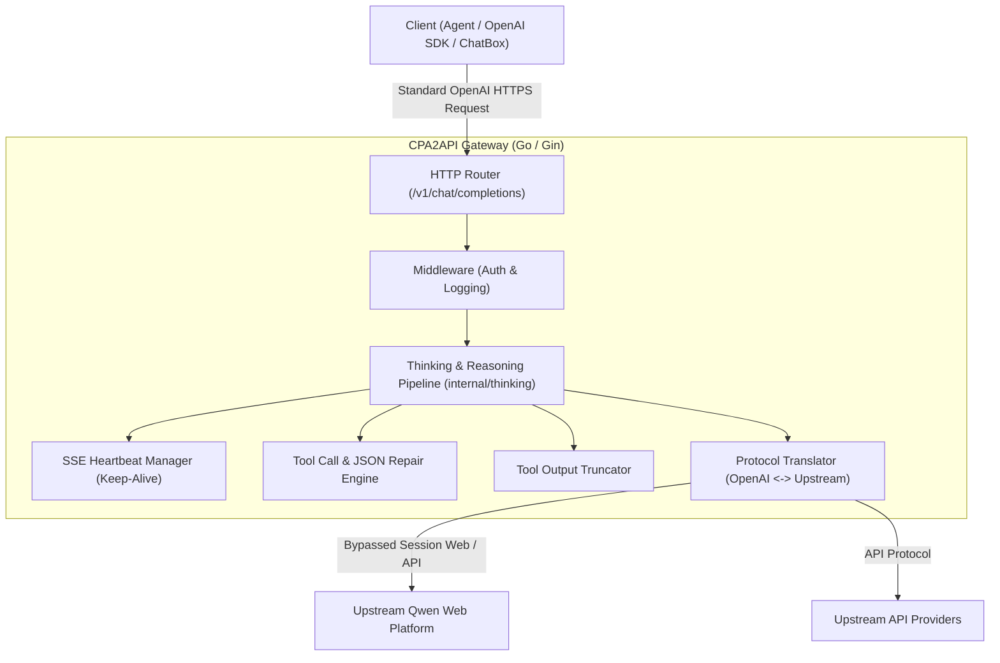

# 🚀 CPA2API

<div align="center">

**专为 Agentic AI 设计的高性能、高可用 OpenAI 兼容 API 网关与代理适配器**

[](https://golang.org)
[](https://hub.docker.com/r/eceasy/cli-proxy-api)
[](LICENSE)
[](CONTRIBUTING.md)
[](#)

</div>

---

## 📖 项目简介

**CPA2API** 是专为 **Agentic AI**（智能体）设计的企业级 API 代理网关。它能够将复杂的上游 Qwen 平台及多模态端点无缝转换为标准的 OpenAI `/v1/chat/completions` API 协议，解决多轮对话状态管理、工具调用（Tool Calling）中的 JSON 畸变、响应超长截断、网络心跳保活等痛点，为各类 AI 智能体框架（如 LangChain、AutoGPT、LlamaIndex 等）及本地客户端提供极致稳定、透明的高性能后端适配服务。

---

## 📐 系统架构

以下是 CPA2API 的核心工作流与架构图：



---

## ✨ 核心特性

*   **🔒 Qwen Web 绕过与会话适配**：内置高级 Session 绕过与智能 Cookie 维护，完美模拟 Web 端交互流程，提供强悍的多轮会话稳定性与高并发控制。
*   **💓 Keep-alive SSE 心跳机制**：在大模型深度思考（Thinking）或执行复杂工具搜索导致响应停顿时，定期向客户端发送轻量级心跳帧，防止 Nginx、CDN 或 HTTP 客户端触发读取超时中断。
*   **🛠️ 智能工具调用与 JSON 修复**：完美契合 Agent 多步骤决策流程，自动解析流式传输中的 `custom_tool_call` XML 标签，并行提取工具调用，并提供自动 JSON 闭合与畸变修复引擎。
*   **✂️ 工具响应输出预算截断**：智能计算并限制工具返回结果的 Token 大小。采用“首尾保留、中间截断”的启发式算法，防止第三方 API 响应过长导致上下文爆满或超出 Token 限制。
*   **🖼️ 多模态视觉上传与转换**：支持多模态视觉模型（VLM）的数据流解析与转换，自动对上传的图片素材进行高效缓存与适配。
*   **📊 无状态会话与 Token 审计**：提供精准的 Token 使用统计，无缝记录消费流水，防范账号上下文跨实例污染。

---

## 🏷️ 版本号规范

本项目采用清晰的版本控制机制，便于追踪上游变更与本地定制：
*   **格式**：`v[UpstreamVersion]-[SkloxoPatchVersion]`
*   **示例**：`v7.1.20-s.1`
    *   **前缀 `v7.1.20`**：同步并映射上游 [CLIProxyAPI](https://github.com/router-for-me/CLIProxyAPI) 官方发行版。
    *   **后缀 `-s.1`**：由 Skloxo 维护的专属定制补丁/优化版本（如 Qwen 自定义 XML 标签绕过、高级流式心跳等特性的演进版本）。

---

## 📦 部署与运行指南

### 方式一：使用 Go 本地开发构建

#### 1. 克隆并安装依赖
确保您的本地 Go 版本为 `1.26+`：
```bash
# 进入后端目录
cd /home/skloxo/aho/openclaw/project/qwen2api/CPA2API

# 下载 Go modules 依赖
go mod download
```

#### 2. 配置应用
拷贝配置模板并进行按需修改：
```bash
cp config.example.yaml config.yaml
# 请根据实际需要修改 config.yaml 中的端口、密钥及上游鉴权信息
```
> [!NOTE]
> 根据安全规范，请务必保管好 `config.yaml`。请不要在任何公开提交中泄露 `auths/` 下的敏感凭据！

#### 3. 运行与验证
```bash
# 格式化代码
gofmt -w .

# 启动本地开发服务
go run ./cmd/server

# 执行单元测试
go test ./...
```

---

### 方式二：使用 Docker Compose 一键部署

我们推荐使用 Docker Compose 进行一键部署与容器化管理。

#### 1. 编写 `docker-compose.yml`
```yaml
version: '3.8'

services:
  cli-proxy-api:
    image: eceasy/cli-proxy-api:v7.1.20-s.1
    container_name: cli-proxy-api
    network_mode: host
    volumes:
      - ./config.yaml:/app/config.yaml
      - ./auths:/root/.cli-proxy-api
      - ./logs:/app/logs
    restart: unless-stopped
    healthcheck:
      test: ["CMD", "curl", "-f", "http://localhost:8080/health"]
      interval: 30s
      timeout: 10s
      retries: 3
```

#### 2. 启动服务
```bash
docker compose up -d
```

---

## 🤝 贡献指南

我们非常欢迎来自社区的贡献与反馈！在提交 PR 或 Issue 之前，请阅读我们的 [CONTRIBUTING.md](CONTRIBUTING.md) 以了解详细的代码规范、测试流程和提交规范。

---

## ⚖️ 免责声明

> [!CAUTION]
> **CPA2API 仅供学术研究、个人学习以及技术验证目的使用，严禁用于任何商业用途。**
> 
> 本项目中所实现的代理及接口转换机制仅作演示与测试。使用者在使用本工具时，必须自行确保其行为完全符合相关服务提供商的使用条款、服务协议以及当地法律法规。开发者对于因使用本软件而导致的任何服务中断、账号封禁，或任何直接、间接的损失及法律责任，均不承担任何责任。
