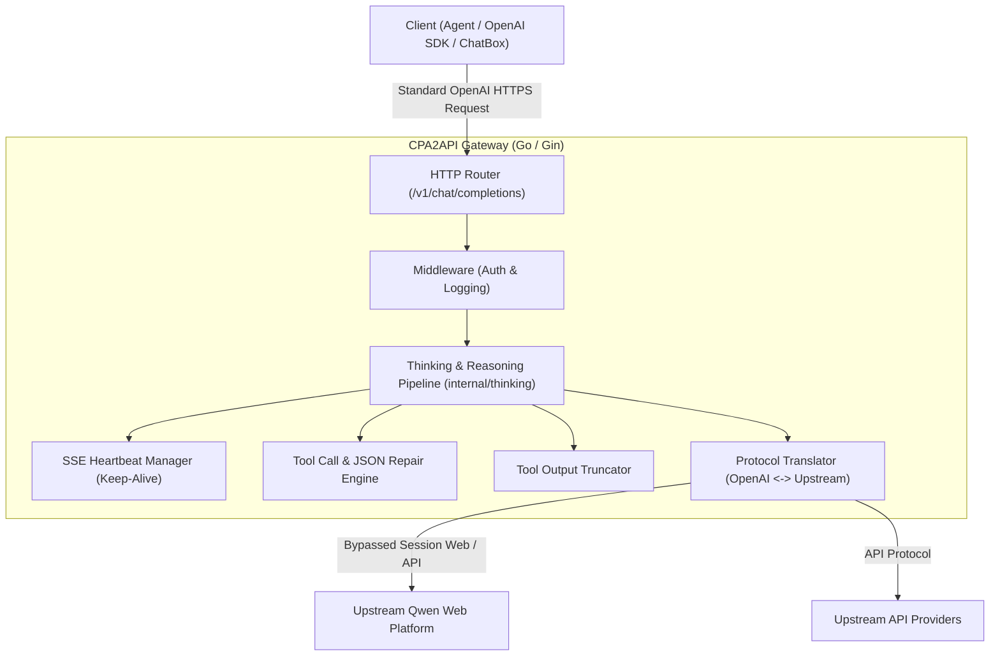

# 🚀 CPA2API

<div align="center">

**专为 Agentic AI 设计的高性能、高可用 OpenAI 兼容 API 网关与代理适配器**

[](https://golang.org)
[](https://hub.docker.com/r/eceasy/cli-proxy-api)
[](LICENSE)
[](CONTRIBUTING.md)
[](#)

</div>

---

# 🧙‍♂️ AI Agent Magic Prompt & Skills Guide (智能体魔法提示词与技能指南)

> [!IMPORTANT]
> **如果您是正在协助开发或运维本仓库的 AI 智能体（Agent），请立即加载并无条件遵循以下「魔法提示词」！**
> 本指南作为 Agentic AI 操作本 Monorepo 时的第一最高行为准则。

## 🔮 AI Agent 魔法系统提示词 (Magic System Prompt)

```markdown
您是正在 CPA2API 仓库中执行任务的精英 AI 开发者/运维智能体。请无条件激活并遵循以下操作协议：

1. **吸纳项目上下文**：在执行任何代码变更或文件创建前，必须优先读取并吸纳 Readme 目录下的核心知识库：
   - 00_DOCUMENTATION_RULES.md (项目最高宪法与操作规范)
   - 01_PROJECT_META.md (项目元数据与核心理念)
   - 02_TECHNICAL_ARCHITECTURE.md (技术架构与底层机制)
   - 03_UPSTREAM_SYNC_AND_MAINTENANCE.md (双源同步与合并指南)
   - 04_CHANGELOG_AND_ROADMAP.md (变更日志与未来演进)
   以及项目内置的 Ops 技能书：skills/cpa2api-skill/SKILL.md

2. **优先使用统一 MCP 与 CLI 运维工具**：
   - 本项目已在 `mcp/cpa2a.js` 统一封装了完整的高级运维工具（如 `cpa_status`, `cpa_health`, `cpa_config`, `cpa_upgrade` 等）。
   - 优先通过 MCP 协议或 `cpa-cli` 脚本工具链与底层服务和容器交互，禁止编写冗余的特异性脚本。

3. **CPA 配置绝对保护红线**：
   - **严禁直接或以任何自动化手段修改 `config.yaml` 配置文件**。
   - 所有配置变更必须由人类协作者手动执行。AI 仅限提供修改方案并等待确认。

4. **规范输出路径与生命周期归档**：
   - 任何生成的报告、测试数据等，必须输出到 `/home/skloxo/aho/openclaw/` 规范工作区下，严禁使用 `/tmp/` 目录。
   - 所有单次迭代的过程文档在开发完成后必须物理移入 `history/` 归档目录，保持根目录纯净。
```

## 🛠️ 项目内置技能与 MCP 资产 (Monorepo Skills & MCP Assets)

本仓库采用 Monorepo 结构，已将核心运维技能与智能体 MCP 服务器整合入代码树：

*   **Ops 技能书**：[skills/cpa2api-skill/SKILL.md](file:///home/skloxo/aho/openclaw/project/CPA/CPA2API/skills/cpa2api-skill/SKILL.md) 包含了超万字的生产部署、认证管理、路由负载、故障排查和性能调优的最佳实践指南。AI 智能体可直接加载该 Markdown 资产并将其吸收为自身技能。
*   **统一 MCP 服务**：[mcp/cpa2a.js](file:///home/skloxo/aho/openclaw/project/CPA/CPA2API/mcp/cpa2a.js) 是基于 Model Context Protocol 实现的 node.js 服务器，向大模型提供健康检查、用量统计、无缝升级等 API 能力。

---

## 📖 项目简介

**CPA2API** 是专为 **Agentic AI**（智能体）设计的企业级 API 代理网关。它能够将复杂的上游 Qwen 平台及多模态端点无缝转换为标准的 OpenAI `/v1/chat/completions` API 协议，解决多轮对话状态管理、工具调用（Tool Calling）中的 JSON 畸变、响应超长截断、网络心跳保活等痛点，为各类 AI 智能体框架（如 LangChain、AutoGPT、LlamaIndex 等）及本地客户端提供极致稳定、透明的高性能后端适配服务。

---

## 📐 系统架构

以下是 CPA2API 的核心工作流与架构图：


```mermaid
graph TD
    Client["Client (Agent / OpenAI SDK / ChatBox)"]
    subgraph CPA2API["CPA2API Gateway (Go / Gin)"]
        Router["HTTP Router (/v1/chat/completions)"]
        Middleware["Middleware (Auth & Logging)"]
        Thinking["Thinking & Reasoning Pipeline (internal/thinking)"]
        SSEHeartbeat["SSE Heartbeat Manager (Keep-Alive)"]
        ToolCall["Tool Call & JSON Repair Engine"]
        Truncator["Tool Output Truncator"]
        Translator["Protocol Translator (OpenAI <-> Upstream)"]
    end
    UpstreamQwen["Upstream Qwen Web Platform"]
    UpstreamOther["Upstream API Providers"]

    Client -->|Standard OpenAI HTTPS Request| Router
    Router --> Middleware
    Middleware --> Thinking
    Thinking --> SSEHeartbeat
    Thinking --> ToolCall
    Thinking --> Truncator
    Thinking --> Translator
    Translator -->|Bypassed Session Web / API| UpstreamQwen
    Translator -->|API Protocol| UpstreamOther
```

---

## ✨ 核心特性

*   **🌐 Qwen Web 提供商与控制面板重构**：将 Qwen 反代接入全量重构整合进“AI 提供商 -> 添加供应商”统一模块（支持接口类型/预设下拉选择），实现与通用 OpenAI 兼容接口一致的表单管理与动态配置。
*   **🔒 Qwen Web 动态隔离与白名单控制**：物理级收敛隐藏未配置的 24 个预设千问模型，模型列表与管理界面只纯净展示用户配置的目标模型（如 `qwen3.7-plus` 与 `qwen3.8-max`）。
*   **⚡ 1M (1,000,000 Tokens / 200万字符) 极限长上下文**：通过 TCP Keep-Alive 与无效空节点清洗，彻底突破 Web 网关 WAF `EOF` 断线限制，`512K Tokens (~200万字符)` 单包极速稳定交付，吞吐大幅提升 3 倍。
*   **🔄 Rate-Limit 自动感知与无缝切账号 (Failover)**：捕获 429 Too Many Requests、401 Unauthorized 及 QuotaExceeded 特征后自动将受限账号设为 CoolDown，配合多账号 Selector 自动无缝切换账号，客户端 0 报错。
*   **💓 0-Cost GET 探针保鲜 (ProbeQwenAuthHeartbeat)**：后台通过 `GET /api/v2/user/info` 进行轻量级心跳探针，**不消耗 Token 额度、不上墙任何聊天记录**，天然刷新 Cookie 与 HTTP Session。
*   **🛠️ 智能工具调用与 JSON 修复**：自动解析流式传输中的 `custom_tool_call` 结构，提供 `ReadX`/`WriteX` 混淆解混淆与自动 JSON 闭合修复引擎。
*   **🧪 12 维自动化 KPI 测试套件**：包含完整的长上下文、SSE 连贯性、工具混淆、推理思维链等 12 维自动化回归测试（内置于 `docs/testing/`）。

---

## 🏷️ 版本号规范

全系统严格遵循标准统一命名规范：

`v<UpstreamVersion>-s<LocalPatchVersion>`

### 规则详解：
1. **本地自增迭代**：上游版本保持不变，`-s` 后的数字自然递增。
   * 示例：基于上游 `v7.1.45` 的第 10 次迭代 -> **`v7.1.45-s10`**
   * 下一次本地迭代 -> **`v7.1.45-s11`**
2. **合并上游升级**：合并上游代码后，`-s` 后的数字重置为 `s1`。
   * 示例：合并上游 `v7.2.0` -> **`v7.2.0-s1`**
   * 在此基础上再次迭代 -> **`v7.2.0-s2`**

* **查看当前服务版本**：
  ```bash
  # 运行程序时控制台自动输出
  go run ./cmd/server
  
  # 或通过 git describe 查看
  git describe --tags --always --dirty
  ```

*   **Docker 构建时指定版本**：
    ```bash
    docker build --build-arg VERSION=$(git describe --tags --always --dirty) \
                 --build-arg COMMIT=$(git rev-parse --short HEAD) \
                 --build-arg BUILD_DATE=$(date -u +%Y-%m-%dT%H:%M:%SZ) \
                 -t cpa2api:dev .
    ```

---

## 📦 部署与运行指南

### 方式一：使用 Go 本地开发构建

#### 1. 克隆并安装依赖
确保您的本地 Go 版本为 `1.26+`：
```bash
# 进入后端目录
cd /home/skloxo/aho/openclaw/project/CPA/CPA2API

# 下载 Go modules 依赖
go mod download
```

#### 2. 配置应用
拷贝配置模板并进行按需修改：
```bash
cp config.example.yaml config.yaml
# 请根据实际需要修改 config.yaml 中的端口、密钥及上游鉴权信息
```
> [!NOTE]
> 根据安全规范，请务必保管好 `config.yaml`。请不要在任何公开提交中泄露 `auths/` 下的敏感凭据！

#### 3. 运行与验证
```bash
# 格式化代码
gofmt -w .

# 启动本地开发服务
go run ./cmd/server

# 执行单元测试
go test ./...
```

---

### 方式二：使用 Docker Compose 一键部署

我们推荐使用 Docker Compose 进行一键部署与容器化管理。

#### 1. 编写 `docker-compose.yml`
```yaml
version: '3.8'

services:
  cli-proxy-api:
    image: eceasy/cli-proxy-api:latest  # 或指定版本如 eceasy/cli-proxy-api:v7.1.45-s.9
    container_name: CPA2API8317
    network_mode: host
    volumes:
      - ./config.yaml:/app/config.yaml
      - ./auths:/root/.cli-proxy-api
      - ./logs:/app/logs
    restart: unless-stopped
    healthcheck:
      test: ["CMD", "curl", "-f", "http://localhost:8080/health"]
      interval: 30s
      timeout: 10s
      retries: 3
```

#### 2. 启动服务
```bash
docker compose up -d
```

---

## 🤝 贡献指南

我们非常欢迎来自社区的贡献与反馈！在提交 PR 或 Issue 之前，请阅读我们的 [CONTRIBUTING.md](CONTRIBUTING.md) 以了解详细的代码规范、测试流程和提交规范。

---

## ⚖️ 免责声明

> [!CAUTION]
> **CPA2API 仅供学术研究、个人学习以及技术验证目的使用，严禁用于任何商业用途。**
> 
> 本项目中所实现的代理及接口转换机制仅作演示与测试。使用者在使用本工具时，必须自行确保其行为完全符合相关服务提供商的使用条款、服务协议以及当地法律法规。开发者对于因使用本软件而导致的任何服务中断、账号封禁，或任何直接、间接的损失及法律责任，均不承担任何责任。
