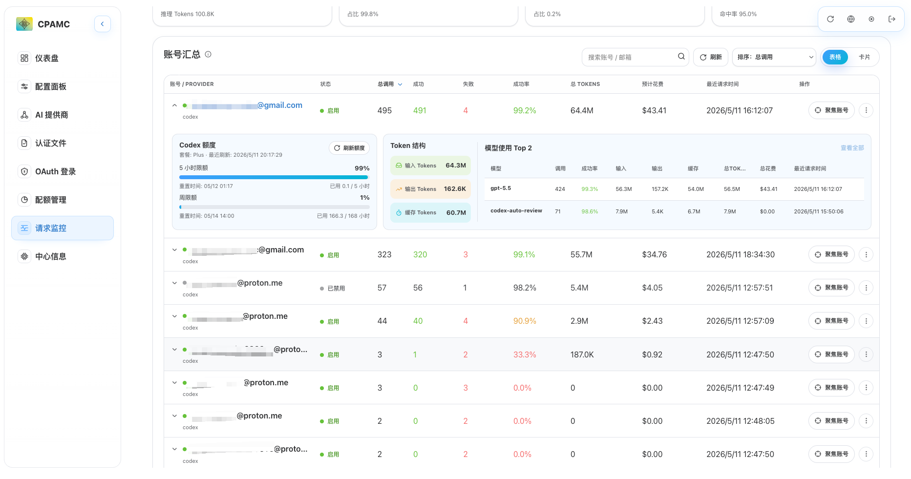
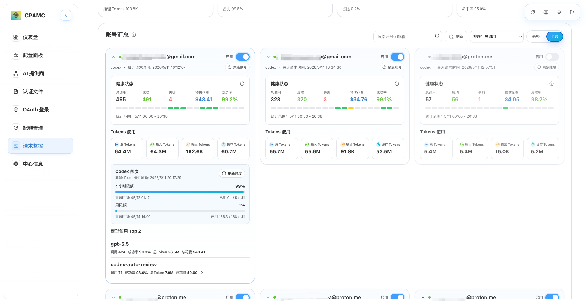
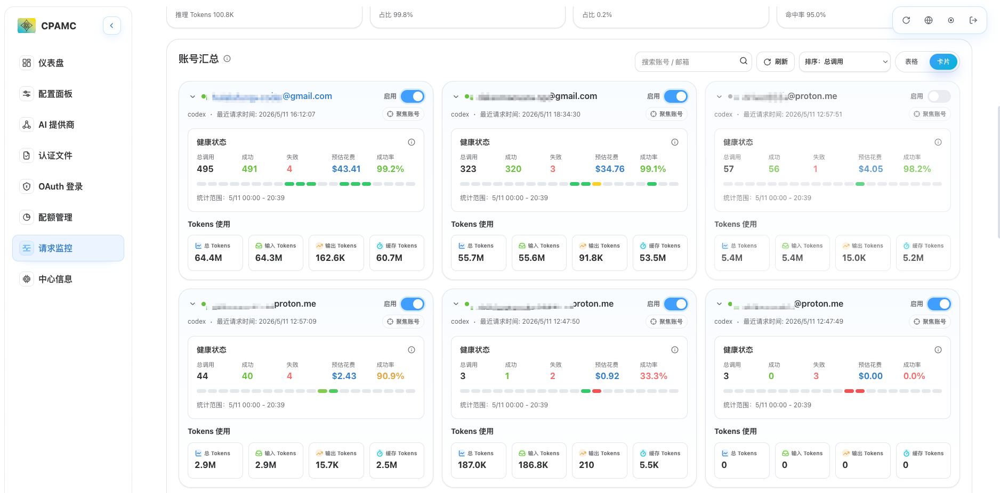
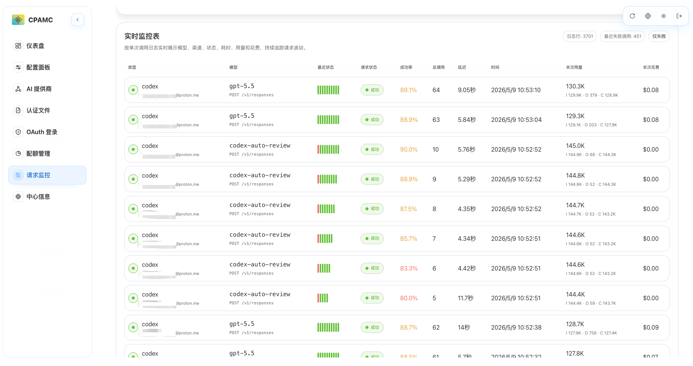
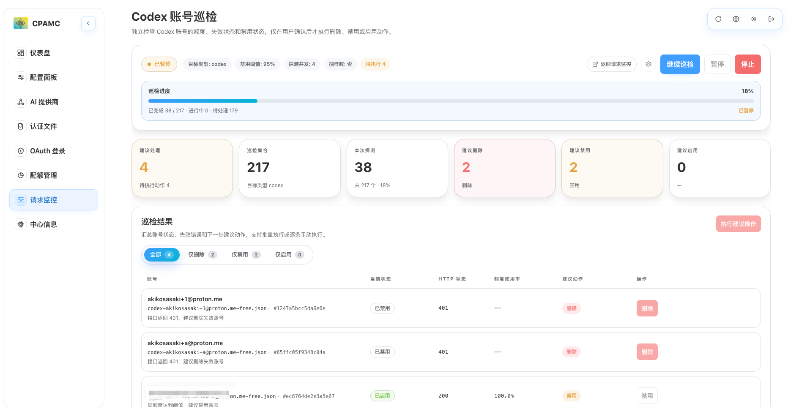

# CLI Proxy API 管理中心

[English](README.md)

这是面向 **CLI Proxy API（CPA）** 的单文件 Web 管理面板，并提供可选的 **Usage Service** 用于持久化请求统计。

CPA 自 v6.10.0 起不再内置用量统计。当前方案通过常驻 Usage Service 消费 CPA 的用量队列，把请求级事件写入 SQLite，并向面板提供兼容的用量查询接口。

- **CPA 主项目**: https://github.com/router-for-me/CLIProxyAPI
- **最低 CPA 版本要求**: >= v7.1.0（推荐最新）

## 面板预览







## 提供什么

- 面向 CPA Management API（`/v0/management`）的单文件 React 管理面板
- Docker 化 Usage Service，用 SQLite 持久化请求统计
- Windows/macOS/Linux 原生 `amd64` 和 `arm64` 运行包，内置管理面板
- 两种部署模式：
  - **完整 Docker 方案**：访问 Usage Service 内置面板，首次 setup 保存 CPA 连接，之后登录只需要 Management Key
  - **CPA 控制面板方案**：继续使用 CPA 的 `/management.html`，然后在面板中配置单独部署的 Usage Service 地址
- 运行时监控、账号/模型/渠道拆解、模型价格、Token 费用估算、导入导出、认证文件管理、配额视图、日志、配置编辑和系统工具

## 选择部署模式

| 模式 | 入口地址 | 用户需要配置 | 适用场景 |
|---|---|---|---|
| 完整 Docker 方案 | `http://<host>:18317/management.html` | 首次 setup：CPA 地址 + Management Key；之后登录：只填 Management Key | 新部署、单入口、最少浏览器/CORS 问题 |
| CPA 控制面板方案 | `http://<cpa-host>:8317/management.html` | 先登录 CPA，再在「配置面板 -> CPA-Manager 配置」配置 Usage Service 地址 | 保留 CPA 自动载入面板的现有习惯 |
| 前端开发方案 | Vite dev server 或 `dist/index.html` | CPA 地址，可选 Usage Service 地址 | 本地开发 |

完整 Docker 方案不内置 CPA 本体。CPA 仍然作为上游服务独立运行；Docker 镜像提供 Usage Service 和内置管理面板。

## CPA 前置条件

请求统计依赖 CPA 的用量队列：

- CPA 必须启用 Management，因为用量队列与 `/v0/management` 使用相同的可用性条件和 Management Key。
- 使用请求监控时，CPA 必须启用用量发布：配置 `usage-statistics-enabled: true`，或通过 `PUT /usage-statistics-enabled` 提交 `{ "value": true }`。CPA-Manager 初始化或保存启用请求监控时会自动打开该开关。
- 关闭 CPAM 请求监控只会停止 Usage Service 采集器，不会自动关闭 CPA 用量发布或清空 CPA 用量队列。如果 CPA 用量发布仍开启，在队列保留时间内再次启用请求监控，可能会采集到关闭采集器期间保留的数据。
- 推荐使用 CPA `v7.1.0+`。CPA `v6.10.8+` 已提供 HTTP 用量队列接口 `/v0/management/usage-queue`，可通过普通 HTTP 反代访问。
- 旧版 CPA 使用 RESP 队列协议。Usage Service 在 `auto` 模式下，只有 subscribe 和 HTTP 队列采集都不可用时才会回退到 RESP。RESP 监听在 CPA API 端口，通常是 `8317`，不能通过普通 HTTP 反代转发。
- CPA 在内存中保留队列项的时间由 `redis-usage-queue-retention-seconds` 控制，默认 `60` 秒，最大 `3600` 秒。Usage Service 应保持常驻运行。
- Usage Service 的 `pollIntervalMs` 必须小于等于 CPA 队列保留时间换算后的毫秒值；否则服务会拒绝保存，避免空闲轮询过慢导致队列项过期。
- 同一个 CPA 实例只应有一个 Usage Service 消费用量队列。

## 架构

### 完整 Docker 方案

```text
浏览器
  -> Usage Service :18317
      -> 内置 management.html
      -> /v0/management/usage 和 /v0/management/model-prices 从 SQLite 返回
      -> 其他 /v0/management/* 反代到 CPA
      -> HTTP/RESP 消费器 -> CPA API 端口
      -> SQLite /data/usage.sqlite
```

登录页会调用 `GET /usage-service/info`，识别当前是否由 Usage Service 托管。如果响应显示尚未配置，会进入 setup wizard：你填写 CPA 地址、Management Key，并选择是否启用请求监控。启用时还需要填写采集轮询间隔，Usage Service 会验证 CPA Management API，启用 CPA 用量统计，校验采集间隔不超过 CPA 队列保留时间，把 CPA-Manager 配置保存到 SQLite，按配置的采集模式启动采集器（默认 `auto`：先 subscribe，再 HTTP 队列，最后回退 RESP），并从同源提供完整管理面板。关闭请求监控时仍会保存 CPA 连接用于反代管理接口，但不会启用 CPA 用量统计或启动采集器。

Usage Service 配置完成后，新浏览器再次打开同一地址会使用普通登录表单。用户只需要输入 Management Key，面板会使用服务端已保存的 CPA 连接。

### CPA 控制面板方案

```text
浏览器
  -> CPA /management.html
      -> 普通 CPA Management API 请求仍然访问 CPA
      -> usage 相关请求访问已配置的 Usage Service

Usage Service
  -> HTTP/RESP 消费器 -> CPA API 端口
  -> SQLite /data/usage.sqlite
```

当你希望保留 CPA 自动下载并托管面板的机制时，使用这个方案。该模式由 CPA 托管页面，因此不会显示 Usage Service 托管面板的 setup wizard。请求监控是可选能力；如果没有部署 Usage Service，面板会自动隐藏请求监控入口，直接访问监控页时会提示先部署并配置 Usage Service。需要请求监控时，先登录 CPA，再单独部署 Usage Service，然后在面板的「配置面板 -> CPA-Manager 配置」中启用并填写地址。

## 快速开始：完整 Docker 方案

### Docker Hub 镜像

```bash
docker run -d \
  --name cpa-manager \
  --restart unless-stopped \
  -p 18317:18317 \
  -v cpa-manager-data:/data \
  seakee/cpa-manager:latest
```

打开：

```text
http://<host>:18317/management.html
```

首次 setup 时填写：

- CPA 地址：
  - Docker Desktop 访问宿主机 CPA：`http://host.docker.internal:8317`（默认建议值；如果面板构建时设置了 `VITE_DEFAULT_CPA_BASE_URL`，则使用该值）
  - 同一 compose 网络：`http://cli-proxy-api:8317`
  - 远程 CPA：`https://your-cpa.example.com`
- Management Key

setup 完成后，同一入口地址会使用 Usage Service SQLite 中保存的 CPA 连接。新浏览器只需要在登录页填写 Management Key。

发布镜像支持 `linux/amd64` 和 `linux/arm64`。如果你的镜像发布在其他 Docker Hub 命名空间，把 `seakee/cpa-manager:latest` 替换成实际镜像名。

### 原生运行包

GitHub Releases 同时提供内置面板的原生运行包：

- `cpa-manager_<version>_linux_amd64.tar.gz`
- `cpa-manager_<version>_linux_arm64.tar.gz`
- `cpa-manager_<version>_darwin_amd64.tar.gz`
- `cpa-manager_<version>_darwin_arm64.tar.gz`
- `cpa-manager_<version>_windows_amd64.zip`
- `cpa-manager_<version>_windows_arm64.zip`

macOS/Linux：

```bash
tar -xzf cpa-manager_vX.Y.Z_linux_amd64.tar.gz
cd cpa-manager_vX.Y.Z_linux_amd64
./cpa-manager
```

tar 包已保留执行权限，正常解压后不需要额外 `chmod +x`。macOS 如果提示无法打开未签名程序，可在解压目录执行 `xattr -dr com.apple.quarantine .` 后再运行。

Windows PowerShell：

```powershell
Expand-Archive .\cpa-manager_vX.Y.Z_windows_amd64.zip -DestinationPath .
cd .\cpa-manager_vX.Y.Z_windows_amd64
.\cpa-manager.exe
```

Windows 可直接双击 `cpa-manager.exe` 启动，但推荐用 PowerShell 运行，方便查看日志和错误信息。

启动后打开：

```text
http://<host>:18317/management.html
```

原生包不包含 CPA 本体。请让 CPA 独立运行，并在首次 setup 时填写 CPA 地址和 Management Key。setup 完成后，登录页只需要 Management Key。需要自定义数据位置时，可以设置 `USAGE_DATA_DIR` 或 `USAGE_DB_PATH` 覆盖默认值。

原生包首次启动时，如果没有设置 `USAGE_DATA_DIR` 或 `USAGE_DB_PATH`，会在程序所在目录自动生成 `config.json`，并把 SQLite 数据写入同目录下的 `data/usage.sqlite`。这样解压后的目录就是完整的程序和用户数据目录。

### Docker Compose

```yaml
services:
  cpa-manager:
    image: seakee/cpa-manager:latest
    restart: unless-stopped
    ports:
      - "18317:18317"
    volumes:
      - cpa-manager-data:/data

volumes:
  cpa-manager-data:
```

启动：

```bash
docker compose up -d
```

### Linux 宿主机运行 CPA

如果 CPA 直接运行在 Linux 宿主机，Usage Service 运行在 Docker 中，需要添加 host gateway：

```bash
docker run -d \
  --name cpa-manager \
  --restart unless-stopped \
  --add-host=host.docker.internal:host-gateway \
  -p 18317:18317 \
  -v cpa-manager-data:/data \
  seakee/cpa-manager:latest
```

然后在首次 setup 时将 CPA 地址填写为 `http://host.docker.internal:8317`。

## 快速开始：CPA 控制面板方案

1. 正常启动 CPA，打开：

   ```text
   http://<cpa-host>:8317/management.html
   ```

   使用 CPA Management Key 登录 CPA。这个入口由 CPA 托管，不使用 Usage Service setup wizard。

2. 单独部署 Usage Service：

   ```bash
   docker run -d \
     --name cpa-manager \
     --restart unless-stopped \
     -p 18317:18317 \
     -v cpa-manager-data:/data \
     seakee/cpa-manager:latest
   ```

3. 在 CPA 面板进入：

   ```text
   配置面板 -> CPA-Manager 配置
   ```

4. 启用并填写：

   ```text
   http://<usage-service-host>:18317
   ```

5. 保存 CPA-Manager 配置。

面板会把当前 CPA 地址和 Management Key 发送给 Usage Service。之后监控页从 Usage Service 读取用量数据，其他管理功能仍然访问 CPA。

## 本地从源码构建

```bash
docker compose -f docker-compose.usage.yml up --build
```

该命令会构建 React 面板，并把它内置到 Go Usage Service 二进制中。

## Usage Service 配置项

大多数用户可以直接在面板的「配置面板 -> CPA-Manager 配置」中配置 CPA 地址、Management Key、是否启用请求监控、采集模式和轮询间隔。CPA-Manager 配置会保存到 SQLite；环境变量更适合首次引导和无人值守部署。

下表是 Usage Service 运行时配置。前端构建时配置是独立的：`VITE_DEFAULT_CPA_BASE_URL` 用于设置 Usage Service 托管面板首次 setup wizard 中展示的默认 CPA 地址；未设置时，Docker 托管面板默认建议 `http://host.docker.internal:8317`。

| 变量 | 默认值 | 说明 |
|---|---:|---|
| `CPA_MANAGER_CONFIG` | 空 | 可选配置文件路径；为空时原生包默认使用程序同目录的 `config.json` |
| `HTTP_ADDR` | `0.0.0.0:18317` | Usage Service HTTP 监听地址 |
| `USAGE_DB_PATH` | Docker：`/data/usage.sqlite`；原生包：`./data/usage.sqlite` | SQLite 数据库路径 |
| `USAGE_DATA_DIR` | Docker：`/data`；原生包：`./data` | 未覆盖 `USAGE_DB_PATH` 时的数据目录 |
| `CPA_UPSTREAM_URL` | 空 | 可选 CPA 地址，用于无人值守启动 |
| `CPA_MANAGEMENT_KEY` | 空 | 可选 CPA Management Key，用于无人值守启动 |
| `CPA_MANAGEMENT_KEY_FILE` | `/run/secrets/cpa_management_key` | 可选密钥文件 |
| `USAGE_COLLECTOR_MODE` | `auto` | 采集方式：`auto` 依次尝试 Redis Pub/Sub 订阅（CPA v7.0.7+）、HTTP 用量队列、RESP 轮询；`subscribe` 强制订阅；`http` 强制 HTTP；`resp` 强制 RESP 轮询 |
| `USAGE_RESP_QUEUE` | `usage` | RESP key 参数；当前 CPA 会忽略该值，除非上游行为变化，否则保持默认即可 |
| `USAGE_RESP_POP_SIDE` | `right` | `right` 使用 `RPOP`；`left` 使用 `LPOP` |
| `USAGE_BATCH_SIZE` | `100` | 每次最多弹出记录数 |
| `USAGE_POLL_INTERVAL_MS` | `500` | 队列空闲时轮询间隔 |
| `USAGE_QUERY_LIMIT` | `50000` | 兼容 `/usage` 最多返回的近期事件数 |
| `USAGE_CORS_ORIGINS` | `*` | CPA 控制面板方案下允许的浏览器来源 |
| `USAGE_RESP_TLS_SKIP_VERIFY` | `false` | RESP TLS 连接是否跳过证书校验 |
| `PANEL_PATH` | 空 | 使用自定义 `management.html` 替代内置面板 |

启动类配置的优先级为：环境变量 > `config.json` > 程序默认值。配置文件中的相对路径按配置文件所在目录解析。默认生成的配置文件内容如下：

```json
{
  "httpAddr": "0.0.0.0:18317",
  "dataDir": "./data"
}
```

如果设置了 `CPA_UPSTREAM_URL` 和 `CPA_MANAGEMENT_KEY`，服务启动后会自动开始采集，并作为环境变量管理的连接配置展示在面板中。否则通过面板 setup 流程配置，保存到 SQLite `settings.manager_config_v1`；旧版 `settings.setup` 会继续写入，用于兼容已有数据和回滚。

### CPA 与 CPA-Manager 配置边界

- **CPA 配置**：`usage-statistics-enabled`、`redis-usage-queue-retention-seconds`、代理、日志、路由、认证文件等仍属于 CPA，由 `/config` / `/config.yaml` 管理。
- **CPA-Manager 配置**：CPA 连接地址、Management Key、请求监控开关、Usage Service 采集模式、`pollIntervalMs`、`batchSize`、`queryLimit`、CPA 控制面板模式下的 Usage Service 引导地址等保存到 Usage Service SQLite。
- 配置面板会分开展示 CPA 与 CPA-Manager 配置。保存 CPAM 配置不会写入 CPA `config.yaml`；启用请求监控时会按要求调用 CPA Management API 启用用量统计，关闭请求监控时只停止 CPAM 采集器。

### 迁移指引

1. 备份 Usage Service 数据目录，尤其是 `/data/usage.sqlite`。
2. 升级后首次打开面板，进入「配置面板 -> CPA-Manager 配置」检查 CPA 地址、请求监控开关、采集模式和轮询间隔。旧数据缺少请求监控开关时按已启用处理。
3. 如果旧版本已经通过 `/setup` 保存过 CPA 地址和 Management Key，服务会从 `settings.setup` 自动生成新的 `settings.manager_config_v1` 视图，并在下次保存时写入新结构。
4. 如果使用环境变量 `CPA_UPSTREAM_URL` / `CPA_MANAGEMENT_KEY`，连接配置仍由环境变量管理；要改为面板持久化，请移除环境变量后重启，再在面板保存。
5. CPA 托管面板模式下，浏览器仍需要先知道 Usage Service 地址才能读取其数据库配置；首次填写后会同步写入 SQLite，并继续保留本地缓存作为 bootstrap。

## 数据与安全说明

- SQLite 数据存储在 `/data`，必须挂载到持久化 volume 或宿主机目录。
- 完整 Docker 方案会把 CPA 地址和 Management Key 保存到 SQLite `settings` 表，用于容器重启后恢复采集。
- 新版会优先读取 SQLite `settings.manager_config_v1`；旧 `settings.setup` 会保留为兼容数据。
- 请保护 `/data` volume，它包含用量元数据和保存的 Management Key。
- Usage Service 会在保存 raw JSON 快照前脱敏疑似密钥字段，但请求元数据仍可能暴露模型、接口、账号标签和 token 用量。
- RESP 队列是弹出式消费，不要让多个 Usage Service 同时消费同一个 CPA 实例。
- 如果 Usage Service 停机超过 CPA 队列保留时间，该时段用量无法在不修改 CPA 的情况下恢复。
- 如果只关闭 CPAM 采集器而 CPA 用量发布仍开启，队列保留时间内重新开启采集器可能会消费停用期间仍保留的队列项。

## 运行时接口

| 接口 | 用途 |
|---|---|
| `GET /health` | 基础健康检查 |
| `GET /status` | 采集器、SQLite、事件数、错误状态 |
| `GET /usage-service/info` | 让前端识别完整 Docker 方案，并通过 `configured` 区分 setup 和登录流程 |
| `GET /usage-service/config` | 读取 CPA-Manager 持久化配置和 CPA 用量统计状态 |
| `PUT /usage-service/config` | 保存 CPA-Manager 配置，并按需重启采集器 |
| `POST /setup` | 保存 CPA 地址和 Management Key，并启动采集 |
| `GET /v0/management/usage` | 面板兼容用量数据 |
| `GET /v0/management/usage/export` | JSONL 导出用量事件 |
| `POST /v0/management/usage/import` | 导入 JSONL 用量事件或旧版 JSON 快照 |
| `GET /v0/management/model-prices` | 读取 SQLite 中保存的模型价格 |
| `PUT /v0/management/model-prices` | 替换已保存的模型价格 |
| `POST /v0/management/model-prices/sync` | 从 LiteLLM 价格元数据同步模型价格 |
| `GET /models`、`GET /v1/models` | setup 后将模型列表请求反代到 CPA |
| `/v0/management/*` | 除 usage 外反代到 CPA |

setup 后，`/status`、用量、模型价格和 `/v0/management/*` 反代接口需要使用同一个 Management Key 作为 Bearer token。

用量导入支持两类文件：Usage Service 导出的 JSONL/NDJSON 事件文件，以及旧版 CPA `/usage/export` 生成的 JSON 快照。旧版 JSON 只有在 `usage.apis.*.models.*.details[]` 明细存在时才能转换为事件；如果文件只包含聚合总量，Usage Service 会拒绝导入，因为无法还原请求级明细。旧版导入属于迁移/恢复能力，不是与 Usage Service 新采集数据完全等价的历史延续：旧文件可能缺少 `api_key_hash`、渠道、请求 ID、method/path、延迟、缓存 token 或失败原因等元数据，账号匹配、API Key 维度分析和明细精度可能低于新采集数据。导入旧文件会影响总量、趋势图和账号/Key 拆解，准确性敏感时建议先导入测试库或备份库验证。

## 功能概览

- **仪表盘**：连接状态、后端版本、快速健康概览
- **配置管理**：可视化和源码模式编辑 CPA 配置，并单独管理 CPA-Manager 配置
- **AI 提供商**：Gemini、Codex、Claude、Vertex、OpenAI 兼容渠道、Ampcode
- **认证文件**：上传、下载、删除、状态、OAuth 排除模型、模型别名
- **配额管理**：支持提供商的配额视图
- **请求监控**：持久化用量 KPI、模型/渠道/账号拆解、模型价格、Token 费用估算、失败分析、展示可读来源和单条优先补充信息的实时表格
- **Codex 账号巡检**：批量探测 Codex 认证池并给出清理建议
- **日志**：增量读取和筛选文件日志
- **中心信息**：模型列表、版本检查、本地状态工具

## 开发命令

前端：

```bash
npm ci
npm run dev
npm run type-check
npm run lint
npm run build
```

打开 `http://localhost:5173`，然后连接到你的 CLI Proxy API 后端实例。

Usage Service：

```bash
cd usage-service
go test ./...
go run ./cmd/cpa-manager
```

## 构建与发布

- Vite 输出单文件 `dist/index.html`
- 打 `vX.Y.Z` 标签会触发 `.github/workflows/release.yml`
- 发布流程会上传 `dist/management.html`、原生运行包和 `checksums.txt` 到 GitHub Releases
- 原生运行包会发布 `linux`、`darwin`、`windows` 的 `amd64` 和 `arm64` 版本，包内已内置管理面板
- 同一个 workflow 会构建 `Dockerfile.usage-service` 并推送 `seakee/cpa-manager`
- Docker 镜像会发布 `linux/amd64` 和 `linux/arm64`
- workflow 会把 `README.md` 同步到 Docker Hub overview
- 系统信息页显示的 UI 版本在构建期注入，优先使用 `VERSION`，其次使用 git tag，最后回退到 `package.json`
- 必需 GitHub secrets：
  - `DOCKERHUB_USERNAME`
  - `DOCKERHUB_TOKEN`

提示：直接用 `file://` 打开 `dist/index.html` 可能遇到浏览器 CORS 限制；更稳妥的方式是用 `npm run preview` 或其他静态服务器打开。

## 技术栈

- React 19 + TypeScript 6.0
- Vite 8（单文件构建）
- Zustand（状态管理）
- Axios（HTTP 客户端）
- react-router-dom v7（HashRouter）
- Motion（动效）
- CodeMirror 6（YAML 编辑器）
- SCSS Modules（样式）
- i18next（国际化）

## 多语言支持

目前支持四种语言：

- 英文 (en)
- 简体中文 (zh-CN)
- 繁体中文 (zh-TW)
- 俄文 (ru)

界面语言会根据浏览器设置自动切换，也可在登录页或顶部语言菜单手动切换。

## 浏览器兼容性

- 构建目标：`ES2020`
- 支持 Chrome、Firefox、Safari、Edge 等现代浏览器
- 支持移动端响应式布局，可通过手机/平板访问。

## 常见问题

- **完整 Docker 方案无法连接 CPA**：确认容器内能访问 CPA 地址。Linux 宿主机 CPA 需要 `--add-host=host.docker.internal:host-gateway`。
- **完整 Docker 方案打开的是登录表单而不是 setup**：Usage Service 已经配置过。输入已保存的 Management Key 即可，CPA 地址来自服务端配置。
- **首次 setup 默认 CPA 地址不符合环境**：使用 `VITE_DEFAULT_CPA_BASE_URL=<your-cpa-url>` 重新构建面板，或手动填写正确的 CPA 地址。
- **监控页为空**：确认 CPA 已启用用量发布，检查 Usage Service `/status`，并确认只有一个消费者。
- **`unsupported RESP prefix 'H'`**：升级 CPA 到 `v7.1.0+` 后保持默认 `USAGE_COLLECTOR_MODE=auto`，Usage Service 会先尝试 subscribe 和 HTTP 用量队列，再回退 RESP；旧版 CPA 或强制 RESP 时，CPA 地址必须是容器/主机内能直连 `8317` 的地址，不能是普通 HTTP 反代域名。
- **Usage Service 返回 401**：使用 setup 时保存的同一个 Management Key。
- **Docker 面板数据不更新**：检查 `/status` 中的 `lastConsumedAt`、`lastInsertedAt`、`lastError`。
- **CPA 控制面板方案有 CORS 错误**：将 `USAGE_CORS_ORIGINS` 设置为 CPA 面板来源；私有部署可保持默认 `*`。
- **容器重建后数据丢失**：确认 `/data` 已挂载到 Docker volume 或宿主机目录。
- **完整 FAQ**：查看 [CPA-Manager 常见问题与解决方案](https://github.com/seakee/CPA-Manager/wiki/CPA%E2%80%90Manager-%E5%B8%B8%E8%A7%81%E9%97%AE%E9%A2%98%E4%B8%8E%E8%A7%A3%E5%86%B3%E6%96%B9%E6%A1%88) 或 [English FAQ and Troubleshooting](https://github.com/seakee/CPA-Manager/wiki/CPA-Manager-FAQ-and-Troubleshooting)。

## 参考

- CPA-Manager Wiki: https://github.com/seakee/CPA-Manager/wiki
- Docker 部署指南: https://github.com/seakee/CPA-Manager/wiki/Docker-%E9%83%A8%E7%BD%B2-CPA%E2%80%90Manager
- Usage Service 使用指南: https://github.com/seakee/CPA-Manager/wiki/CPA%E2%80%90Manager-Usage-Service-%E4%BD%BF%E7%94%A8%E6%8C%87%E5%8D%97
- 反向代理指南: https://github.com/seakee/CPA-Manager/wiki/%E7%94%A8%E5%90%8C%E4%B8%80%E4%B8%AA%E5%9F%9F%E5%90%8D%E5%8F%8D%E4%BB%A3-CPA-%E4%B8%8E-CPA%E2%80%90Manager
- 常见问题与解决方案: https://github.com/seakee/CPA-Manager/wiki/CPA%E2%80%90Manager-%E5%B8%B8%E8%A7%81%E9%97%AE%E9%A2%98%E4%B8%8E%E8%A7%A3%E5%86%B3%E6%96%B9%E6%A1%88
- CLIProxyAPI: https://github.com/router-for-me/CLIProxyAPI
- Redis 用量队列文档: https://help.router-for.me/management/redis-usage-queue.html

## 致谢

- 感谢上游项目 [CLIProxyAPI](https://github.com/router-for-me/CLIProxyAPI) 和 [Cli-Proxy-API-Management-Center](https://github.com/router-for-me/Cli-Proxy-API-Management-Center) 提供基础与参考。
- 感谢 [Linux.do](https://linux.do/) 社区对项目推广与反馈的支持。

## 许可证

MIT
